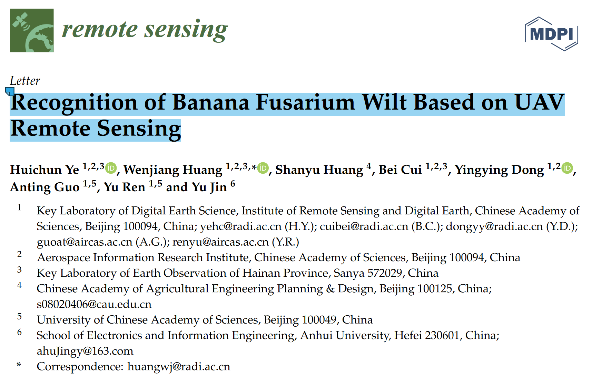
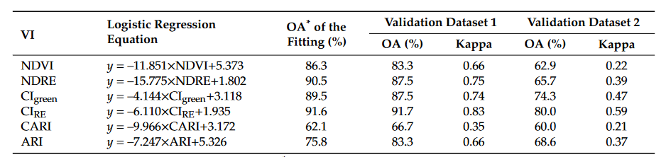
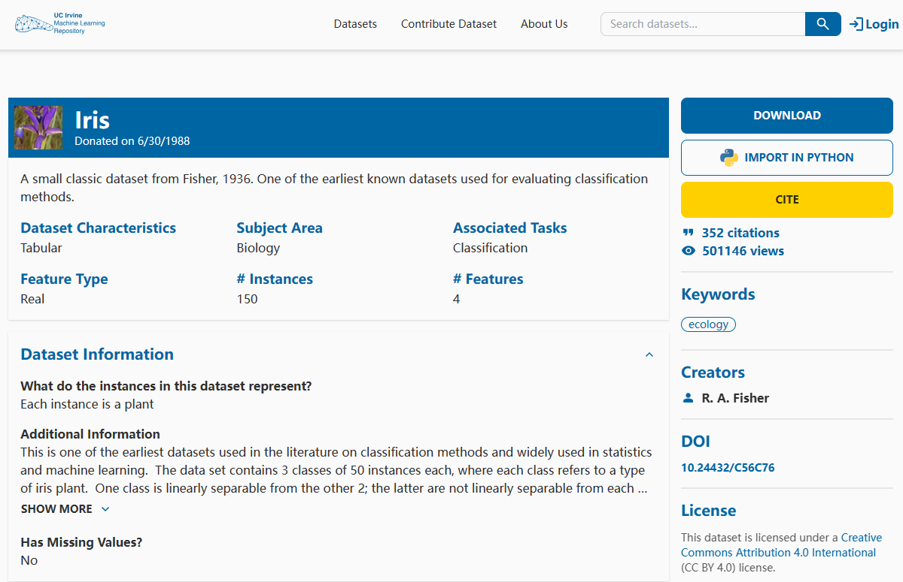
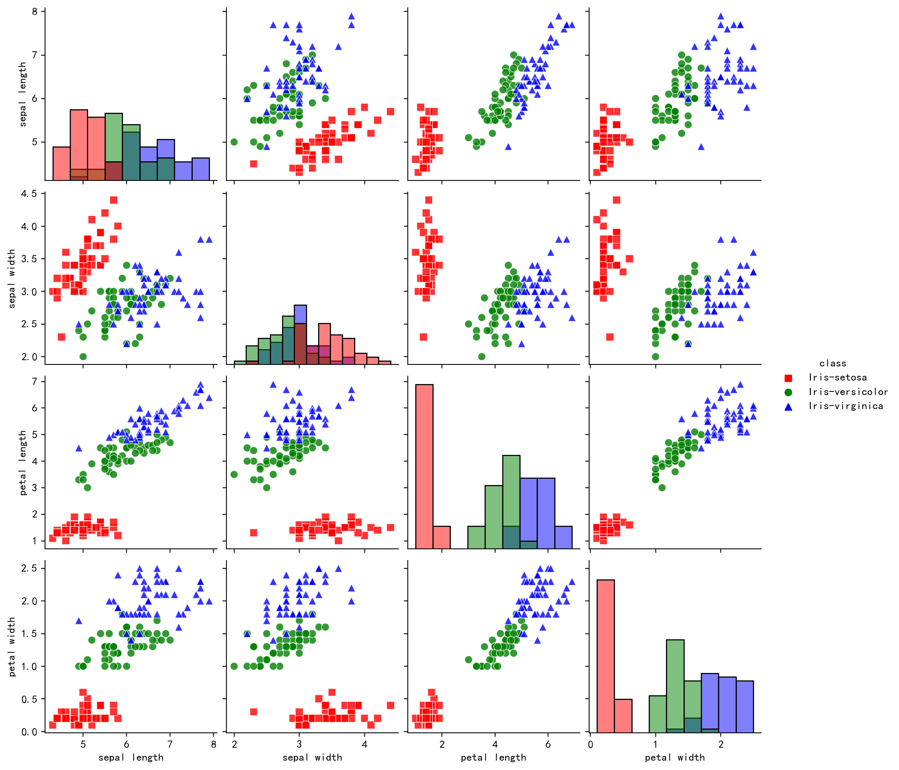
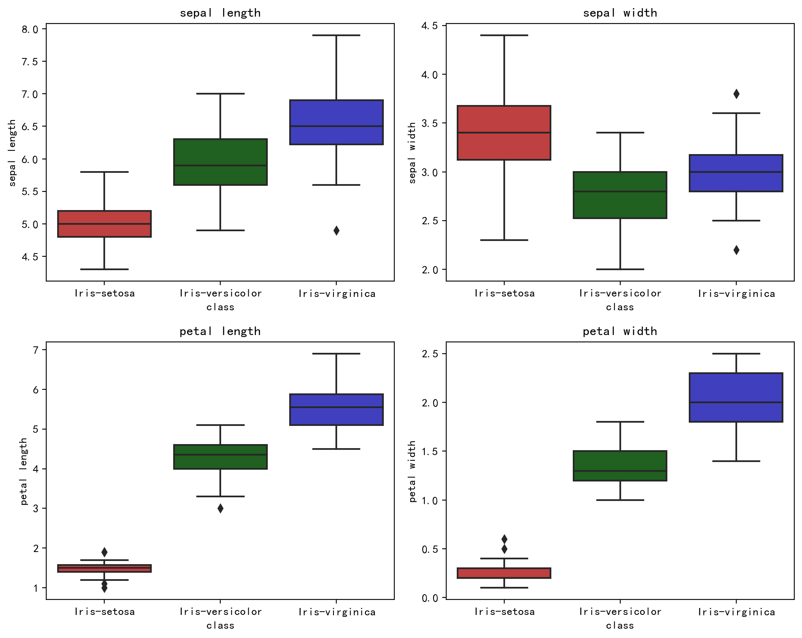
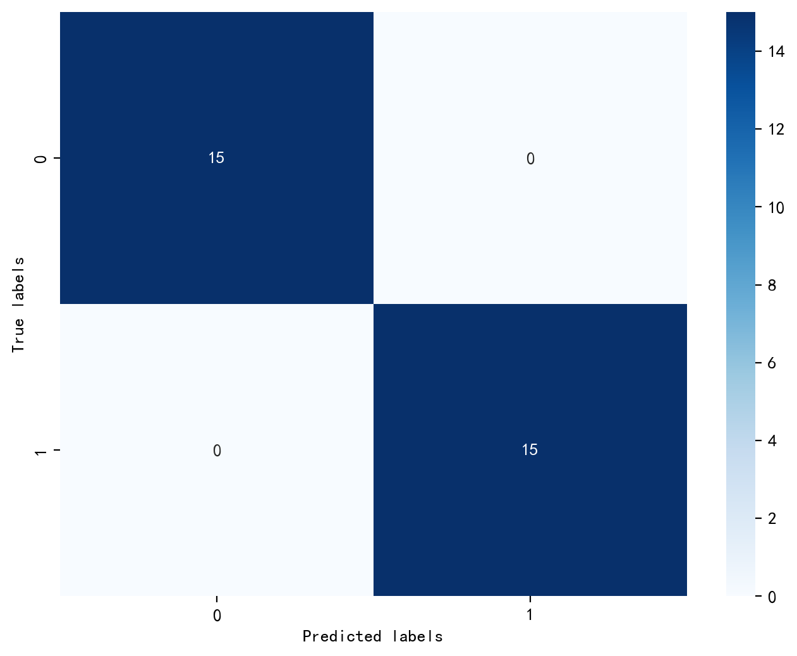

# 期末大作业：文献中的实验方法和数据分析方法学习汇报

源文件为ipynb格式。<br>
源文件链接：<br>
[GitHub Mosazh_AEDSA](https://github.com/Mosazh/AEDSA/blob/main/BigJob/BigJob.ipynb) <br>
[Gitee Mosah_AEDSA](https://gitee.com/mosah/aedsa/blob/master/BigJob/BigJob.ipynb)

参考文献 [*Recognition of Banana Fusarium Wilt Based on UAV Remote Sensing*](https://www.mdpi.com/2072-4292/12/6/938)原文见附录。



参考文献中主要使用了二分类逻辑回归 (Binary Logistic Regression)此方法来进行对于数据的统计分析,评估了 VIs 与受镰刀菌枯萎病感染或未感染植株之间的空间关系。

文献中使用了BLR方法来确定建立**香蕉枯萎病识别模型**的最佳**敏感光谱波段**或**植被指数**，以及评估不同图像分辨率对香蕉镰刀菌枯萎病识别精度的影响，为卫星数据的大规模应用提供参考。

参考文献中使用的八种VIs

| Vegetation Index     | Description |  Formulation | Sensitive Parameter|
| ----------- | ----------- | ----------- | ----------- |
| $NVDI$        | Normalized difference vegetation index  | $\Large \frac{R_{NIR}-R_{red}}{R_{NIR}+R_{red}}$ | Leaf area index, green biomass |
| $NDRE$        | Normalized difference red edge index    | $\Large \frac{R_{NIR}-R_{RE}}{R_{NIR}+R_{RE}}$   | Leaf area index, green biomass |
| $CI_{green}$  | Green chlorophyll index                 | $\Large \frac{R_{NIR}}{R_{green}-1}$ | Chlorophyll content |
| $CI_{RE}$     | Red-edge chlorophyll index              | $\Large \frac{R_{NIR}}{R_{RE}-1}$    | Chlorophyll content |
| $SIPI$        | Structural independent pigment index       | $\Large \frac{R_{NIR}-R_{blue}}{R_{NIR}-R_{red}}$ | Pigment content |
| $SIPI_{RE}$   | Red-edge structural independent pigment index        | $\Large \frac{R_{RE}-R_{blue}}{R_{RE}-R_{red}}$ | Pigment content |
| $CARI$        | Carotenoid index        | $\Large \frac{R_{RE}}{R_{green}-1}$ | Carotenoid content |
| $ARI$         | Anthocyanin reflectance index        | $\Large \frac{1}{R_{green}}-\frac{1}{R_{RE}}$ | Anthocyanin content |

**不同植被指数的逻辑回归模型**


由于无法获取到原始数据，故在本次作业中使用了[**Iris 鸢尾花数据集**](https://archive.ics.uci.edu/dataset/53/iris)采用BLR进行数据分析




## 二分类逻辑回归模型构建
二分类逻辑回归是一种统计分析方法，用于建立一个二元因变量与一个或多个自变量之间的关系模型。它是一种广义线性模型，用于预测二元因变量的概率。在研究中，二元逻辑回归常用于解决分类问题，例如预测疾病的发生与否、判断某个事件是否发生等。该模型通过估计自变量与因变量之间的关系系数，从而预测因变量的概率。

BLR其实际分析上是研究X对于Y的影响，而且Y为二分类数据，比如是否愿意购买产品，是否喜欢，是否购买直播带货商品等。数字1代表YES，数字0代表NO。而且X对于Y的影响时，数学模型可构建如下：
$$
\ln{(\frac{P}{1-P})} = \beta_0 +  \beta_1X_1 + \beta_2X_2 + \cdots + \beta_mX_m
$$
经过简单变换，可以转换为：
$$
P = \frac{1}{1 + e^{-(\beta_0 + \beta_1X_1 + \beta_2X_2 + \cdots + \beta_mX_m)}}
$$

**优点：**
1. 实现简单。逻辑回归的参数可以用极大似然估计法进行求解，算法本身非常简单。
2. 速度快。逻辑回归计算量小，训练速度快。
3. 输出结果易于理解。逻辑回归的输出结果是概率，易于解释。
4. 容易扩展。逻辑回归可用于多分类问题和不平衡数据集。

**缺点：**
1. 只适用于线性可分的问题。当特征之间存在非线性关系时，Logistic回归的效果会受到限制。
2. 对异常值敏感。由于Logistic回归使用了sigmoid函数，对于异常值非常敏感。
3. 容易欠拟合。当特征与目标变量之间的关系非常复杂时，Logistic回归很容易出现欠拟合现象

## Iris数据集数据处理

Iris数据集共有150个样本，目标变量为花的类别其都属于鸢尾属下的三个亚属（*target*），分别是山鸢尾 (*Iris-setosa*)，变色鸢尾(*Iris-versicolor*)和维吉尼亚鸢尾(*Iris-virginica*)。

四个特征，分别是花萼长度(sepal length)、花萼宽度(sepal width)、花瓣长度(petal length)、花瓣宽度(petal width)。

### 初始化


```python
import numpy as np
import pandas as pd
import matplotlib.pyplot as plt
import seaborn as sns
import warnings
warnings.filterwarnings("ignore")

plt.rc("font",family='KaiTi')       #指定中文字体，不然会乱码
#%matplotlib inline是Jupyter Notebook的魔术命令，用于在 Notebook 中以行内方式显示 matplotlib 绘图
%config InlineBackend.figure_format = 'retina'      #绘制高清图像
%matplotlib inline

```

### 导入数据


```python
# 从文件中读取iris数据集
iris_features = pd.read_csv('iris/iris.data', header=None, names=['sepal length', 'sepal width', \
                                                                  'petal length', 'petal width', 'class'])

# 提取目标变量
iris_class = iris_features['class']
iris_target = np.repeat(np.arange(3), 50)
iris_target = iris_target.astype(int)  # 将数据类型转换为整数类型

# 显示前几行数据
print(iris_features.head(),"\n")

## 查看数据的整体信息
iris_features.info()

## 查看每个类别数量
pd.Series(iris_target).value_counts()

```

       sepal length  sepal width  petal length  petal width        class
    0           5.1          3.5           1.4          0.2  Iris-setosa
    1           4.9          3.0           1.4          0.2  Iris-setosa
    2           4.7          3.2           1.3          0.2  Iris-setosa
    3           4.6          3.1           1.5          0.2  Iris-setosa
    4           5.0          3.6           1.4          0.2  Iris-setosa

    <class 'pandas.core.frame.DataFrame'>
    RangeIndex: 150 entries, 0 to 149
    Data columns (total 5 columns):
     #   Column        Non-Null Count  Dtype
    ---  ------        --------------  -----
     0   sepal length  150 non-null    float64
     1   sepal width   150 non-null    float64
     2   petal length  150 non-null    float64
     3   petal width   150 non-null    float64
     4   class         150 non-null    object
    dtypes: float64(4), object(1)
    memory usage: 6.0+ KB


    0    50
    1    50
    2    50
    Name: count, dtype: int64

```python
## 对于特征进行一些统计描述
iris_features.describe()

```

<div>
<style scoped>
    .dataframe tbody tr th:only-of-type {
        vertical-align: middle;
    }

    .dataframe tbody tr th {
        vertical-align: top;
    }

    .dataframe thead th {
        text-align: right;
    }
</style>
<table border="1" class="dataframe">
  <thead>
    <tr style="text-align: right;">
      <th></th>
      <th>sepal length</th>
      <th>sepal width</th>
      <th>petal length</th>
      <th>petal width</th>
    </tr>
  </thead>
  <tbody>
    <tr>
      <th>count</th>
      <td>150.000000</td>
      <td>150.000000</td>
      <td>150.000000</td>
      <td>150.000000</td>
    </tr>
    <tr>
      <th>mean</th>
      <td>5.843333</td>
      <td>3.054000</td>
      <td>3.758667</td>
      <td>1.198667</td>
    </tr>
    <tr>
      <th>std</th>
      <td>0.828066</td>
      <td>0.433594</td>
      <td>1.764420</td>
      <td>0.763161</td>
    </tr>
    <tr>
      <th>min</th>
      <td>4.300000</td>
      <td>2.000000</td>
      <td>1.000000</td>
      <td>0.100000</td>
    </tr>
    <tr>
      <th>25%</th>
      <td>5.100000</td>
      <td>2.800000</td>
      <td>1.600000</td>
      <td>0.300000</td>
    </tr>
    <tr>
      <th>50%</th>
      <td>5.800000</td>
      <td>3.000000</td>
      <td>4.350000</td>
      <td>1.300000</td>
    </tr>
    <tr>
      <th>75%</th>
      <td>6.400000</td>
      <td>3.300000</td>
      <td>5.100000</td>
      <td>1.800000</td>
    </tr>
    <tr>
      <th>max</th>
      <td>7.900000</td>
      <td>4.400000</td>
      <td>6.900000</td>
      <td>2.500000</td>
    </tr>
  </tbody>
</table>
</div>


## 可视化

### 条形图与散点图


```python
## 合并标签和特征信息
iris_all = iris_features.copy() ##进行浅拷贝，防止对于原始数据的修改

## 可视化
sns.pairplot(data=iris_all, diag_kind='hist', hue='class', palette=['r', 'g', 'b'],\
            markers=["s", "o", "^"], plot_kws={'alpha':0.8, 's': 50})

plt.show()

```


### 箱型图


```python
# 创建画布和子图
fig, axes = plt.subplots(nrows=2, ncols=2, figsize=(10, 8))

# 选择要绘制的特征列
features_to_plot = iris_features.columns[:4]

# 设置红绿蓝三色的调色板
custom_palette = {'Iris-setosa': "red", 'Iris-versicolor': "green", 'Iris-virginica': "blue"}

# 可视化
for i, col in enumerate(features_to_plot):
    sns.boxplot(x=iris_class, y=col, saturation=0.5, palette=custom_palette, \
                data=iris_features, ax=axes[i//2, i%2])
    axes[i//2, i%2].set_title(col)

plt.tight_layout()
plt.show()


```


可以透过上图大致看出鸢尾花品种与 *花萼长度(sepal length)、花萼宽度(sepal width)、花瓣长度(petal length)、花瓣宽度(petal width)* 四个特征之间的关系。

## 模型建立与预测

### 二分类预测


```python
## 划分为训练集和测试集
from sklearn.model_selection import train_test_split

# 删除 "class" 列
iris_all = iris_all.drop(columns=["class"])

## 选择其类别为0和1的样本 （不包括类别为2的样本）
iris_features_part = iris_all.iloc[:100]
iris_target_part = iris_target[:100]

# 训练集测试集7/3分
x_train, x_test, y_train, y_test = train_test_split(iris_features_part, iris_target_part, \
                                                    test_size = 0.3, random_state = 2020)

## 从sklearn中导入逻辑回归模型
from sklearn.linear_model import LogisticRegression
clf = LogisticRegression(random_state=0, solver='lbfgs')

# 训练模型
clf.fit(x_train, y_train)


```

```python
## 查看其对应的βm,β0
print(clf.coef_, clf.intercept_)

```

    [[ 0.52127713 -0.73985831  2.05323254  0.86609499]] [-6.91417548]


可知建立的模型可表示为：
$$
Y = \ln{(\frac{P}{1-P})} = -6.9142 +  0.5213X_1 - 0.7399X_2 + 2.0532X_3 + 0.8661X_4
$$


```python
## 预测模型
train_predict = clf.predict(x_train)
test_predict = clf.predict(x_test)

```


```python
from sklearn import metrics

# 计算精确度、召回率和 F1 指数
precision = metrics.precision_score(y_test, test_predict)
recall = metrics.recall_score(y_test, test_predict)
f1_score = metrics.f1_score(y_test, test_predict)

print('Precision: {:.2f}'.format(precision))
print('Recall: {:.2f}'.format(recall))
print('F1 Score: {:.2f}'.format(f1_score))

```

    Precision: 1.00
    Recall: 1.00
    F1 Score: 1.00


|$ 指标 $|$ 数值 $|
|----|----|
|$ Precision $|$ 1.00 $|
|$ Recall $|$ 1.00 $|
|$F1-Score $|$ 1.00 $|


```python
## 查看混淆矩阵 (预测值和真实值的各类情况统计矩阵)
confusion_matrix_result = metrics.confusion_matrix(test_predict,y_test)

# 可视化
plt.figure(figsize=(8, 6))
sns.heatmap(confusion_matrix_result, annot=True, cmap='Blues')
plt.xlabel('Predicted labels')
plt.ylabel('True labels')
plt.show()

```



**可知，使用*sklearn.linear_model*建立的二分类模型可以很好的基于鸢尾花的四项特征进行分类。**

## 附录
***Recognition of Banana Fusarium Wilt Based on UAV Remote Sensing***
